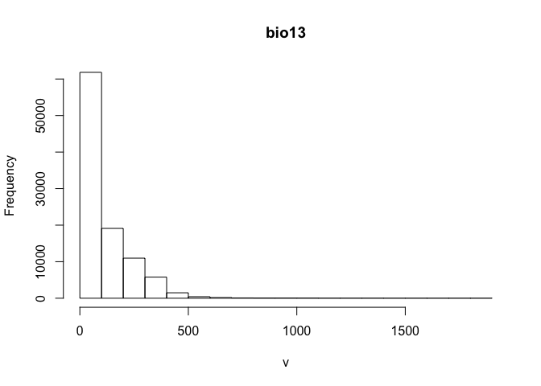

##1. Set up the working environment  
###1.1 Load packages  
Running Maxent in R requires several packages. Specifically, the "dismo" package, which contains *maxent* function that calls *maxent.jar* in R, the *raster* package, which provides functions for analyzing gridded data, the *rgeos* package, which provides functions for analyzing spatial data.

#####Thread 1

```r
packages_needed <- c("raster", # for raster analysis
                     "dismo", # a collection of ENM/SDM tools
                     "rgeos","rgdal","sp", # spatial data analysis
                     "ENMeval", # a few new tools in ENM/SDM
                     "utils", # for zip & unzip files
                     "jsonlite" # necessary for download data from GBIF
                     )
pk_to_install <- packages_needed [!( packages_needed %in% rownames(installed.packages())  )]
if(length(pk_to_install)>0 ){
  install.packages(pk_to_install,repos="http://cran.r-project.org")
}
#lapply(packages_needed, require, character.only = TRUE)
library("raster")
library("dismo")
library("rgeos")
library("rgdal")
library("sp")
library("ENMeval")
```
																												   
#####Thread 2

```r
if( !("rJava" %in% rownames(installed.packages()))  ){
  install.packages("rJava",repos="http://cran.r-project.org")
}
#If you are using a Mac machine, an additional step may be needed before loading rJava package
#dyn.load('/Library/Java/JavaVirtualMachines/jdk1.8.0_144.jdk/Contents/Home/jre/lib/server/libjvm.dylib')
dyn.load('/Library/Java/JavaVirtualMachines/jdk1.8.0_171.jdk/Contents/Home/jre/lib/server/libjvm.dylib')
library("rJava")
```


###1.2 Set up the Maxent path  
In order for Maxent to work properly in R, the *maxent.jar* file needs to be accessible by *dismo* package.  

#####Thread 4

```r
# download maxent.jar 3.3.3k, and place the file in the desired folder; note that, there may be a newer version of Maxent
if( !file.exists(paste0(system.file("java", package="dismo"),"/maxent.jar"))  )   {
utils::download.file(url="https://raw.githubusercontent.com/mrmaxent/Maxent/master/ArchivedReleases/3.3.3k/maxent.jar",
                     destfile=paste0(system.file("java", package="dismo"),"/maxent.jar"),
                     mode="wb") ## wb for binary file, otherwise maxent.jar can not execute
}
# also note that both R and Java need to be the same bit (either 32 or 64) to be compatible to run

# to increase memory size of the JVM and prevent memory issues with Maxent.jar
# options( java.parameters = c("-Xss2560k", "-Xmx2g") ) 
```


##2. Prepare data input  
###2.1 Load environmental layers 
In our example, we use bioclimatic variables (downloaded from worldclim.org) as input environmental layers. We stack our environmental layers so that they can be processed simultaneously.  

#####Thread 5 

```r
# prepare a folder in which downloaded and processed data will be input and a folder 
# for model outputs
if(!file.exists("data")) dir.create("data")
if(!file.exists("data/bioclim")) dir.create("data/bioclim")
if(!file.exists("data/studyarea")) dir.create("data/studyarea")
if(!file.exists("output")) dir.create("output")
require(utils)
# download climate data from worldclim.org
if( !file.exists( paste0("data/bioclim/bio_10m_bil.zip")   )){
utils::download.file(url="http://biogeo.ucdavis.edu/data/climate/worldclim/1_4/grid/cur/bio_10m_bil.zip",
                     destfile=paste0("data/bioclim/bio_10m_bil.zip")) 
utils::unzip("data/bioclim/bio_10m_bil.zip",exdir="data/bioclim/")
}
# This searches for all files that are in the path "data/bioclim/" and 
# have a file extension of .bil. You can edit this code to reflect the path name 
# and file extension for your environmental variables
clim_list <- list.files("data/bioclim/",pattern=".bil$",full.names = T) # '..' leads to the path above the folder where the .rmd file is located

# stacking the bioclim variables to process them at one go 
clim <- raster::stack(clim_list) 
```

####2.1.1 simple Raster manipulation    

```r
# we want the new layer to be 10 times coarser at each axis (100 times coarser). In essence, we are resampling the resolution from 10 min to 100 min.
bio1 <- clim[[1]]
bio1
```

```
## class       : RasterLayer 
## dimensions  : 900, 2160, 1944000  (nrow, ncol, ncell)
## resolution  : 0.1666667, 0.1666667  (x, y)
## extent      : -180, 180, -60, 90  (xmin, xmax, ymin, ymax)
## coord. ref. : +proj=longlat +datum=WGS84 +no_defs +ellps=WGS84 +towgs84=0,0,0 
## data source : /Users/labmac/Desktop/ENM_demo/peerj example/workshop_maxent_R-master/data/bioclim/bio1.bil 
## names       : bio1 
## values      : -269, 314  (min, max)
```

```r
nrow(bio1)
```

```
## [1] 900
```

```r
ncol(bio1)
```

```
## [1] 2160
```

```r
extent(bio1)
```

```
## class       : Extent 
## xmin        : -180 
## xmax        : 180 
## ymin        : -60 
## ymax        : 90
```

```r
# define new resolution
newRaster <- raster( nrow= nrow(bio1)/10 , ncol= ncol(bio1)/10 )

# define the extent of the new coarser resolution raster
extent(newRaster) <- extent(bio1)

# fill the new layer with new values
newRaster <- resample(x=bio1,y=newRaster,method='bilinear')
plot(bio1)
```

<!-- -->

```r
plot(newRaster) 
```

<!-- -->

```r
# when viewing the new layer, we see that it appears coarser
```

####2.1.2 reclassify raster layer    


```r
# For example, if we want to classify the world into two classes based on temperature, areas that are higher than 100 and areas that are lower than 100...we would 

myLayer<- raster("data/bioclim/bio1.bil")

# values smaller than 10C becomes 1; values larger than 10C will be 2
myMethod <- c(-Inf, 100, 1, # from, to, new value
              100, Inf, 2)
myLayer_classified <- reclassify(myLayer,rcl= myMethod)
plot(myLayer_classified)
```

<!-- -->

####2.1.3 raster calculation    


```r
# read precipitation data 
wet <- raster("data/bioclim/bio13.bil") # precipitation of wettest month
dry <- raster("data/bioclim/bio14.bil") # precipitation of driest month
plot(stack(wet,dry))
```

<!-- -->

```r
# To calculate difference between these two rasters
diff <- wet - dry
#plot(diff)

# To calculate the mean between the dry and wet rasters
twoLayers <- stack(wet,dry)
meanPPT <- calc(twoLayers,fun=mean)
#plot(meanPPT)

# the following code gives the same results
meanPPT2 <-  (wet + dry)/2

# to display the histogram of one layer
hist(twoLayers[[1]])
```

```
## Warning in .hist1(x, maxpixels = maxpixels, main = main, plot = plot, ...):
## 5% of the raster cells were used. 100000 values used.
```

<!-- -->

```r
# to run correlations between different layers
pairs(twoLayers[[1:2]])
```

<!-- -->


###2.2 Occurrence data  
####2.2.1 Download occurrence data  
For our example, we download occurrence data for the nine-banded armadillo from GBIF.org (Global Biodiversity Information Facility). 

#####Thread 6

```r
# We provide an if/else statement that checks for occurrence data that have already been downloaded.
# The goal of this module is to avoid downloading the occurrence data multiple times.
require(jsonlite)				 
```

```
## Loading required package: jsonlite
```

```r
if(file.exists("data/occ_raw")){
  load("data/occ_raw")
}else{
  occ_raw <- gbif(genus="Dasypus",species="novemcinctus")
  save(occ_raw,file = "data/occ_raw")
  write.csv("data/occ_raw.csv")
}

# to view the first few lines of the occurrence dataset use:
# head( occ_raw )
```

####2.2.2 Clean occurrence data
Since some of our records do not have appropriate coordinates and some have missing locational data, we need to remove them from our dataset. To do this, we created a new dataset named “occ_clean”, which is a subset of the “occ_raw” dataset where records with missing latitude and/or longitude are removed. This particular piece of code also returns the number of records that are removed from the dataset. Additionally, we remove duplicate records and create a subset of the cleaned data with the duplicates removed. 

#####Thread 7: remove data without coordinates, remove duplicated coordinates, keep only occurence data associated with an actulal specimen, and limit the temporal range of data

```r
# here we remove erroneous coordinates, where either the latitude or longitude is missing
occ_clean <- subset(occ_raw,(!is.na(lat))&(!is.na(lon))) 
#  "!" means the opposite logic value
cat(nrow(occ_raw)-nrow(occ_clean), "records are removed")
```

```
## 2337 records are removed
```

```r
# remove duplicated data based on latitude and longitude
dups <- duplicated(occ_clean[c("lat","lon")])
occ_unique <- occ_clean[!dups,]
cat(nrow(occ_clean)-nrow(occ_unique), "records are removed")
```

```
## 1205 records are removed
```

```r
# only keep record that are associted with a specimen
table(occ_unique$basisOfRecord)
```

```
## 
##     FOSSIL_SPECIMEN   HUMAN_OBSERVATION          LITERATURE 
##                  13                1908                   8 
## MACHINE_OBSERVATION         OBSERVATION  PRESERVED_SPECIMEN 
##                  26                  34                 906 
##             UNKNOWN 
##                 247
```

```r
occ_unique <- subset(occ_unique, basisOfRecord=="PRESERVED_SPECIMEN")
table(occ_unique$basisOfRecord)
```

```
## 
## PRESERVED_SPECIMEN 
##                906
```

```r
# to filter the species records by year, in this example 1950 to present:
# shows frequency of records based on year
table(occ_unique$year)
```

```
## 
## 1855 1881 1882 1892 1893 1895 1897 1903 1904 1905 1906 1909 1911 1912 1913 
##    1    1    1    2    1    2    1    1    1    3    1    2    2    1    2 
## 1914 1922 1923 1924 1925 1926 1927 1928 1929 1930 1931 1932 1933 1934 1935 
##    2    6    1    2    1    8    3    1    2    3    2    2    2    3    1 
## 1936 1937 1938 1939 1940 1941 1942 1943 1944 1945 1946 1947 1948 1949 1950 
##    4    2    3    3    3    4    6    2    4    3    8    8    6   18   10 
## 1951 1952 1953 1954 1955 1956 1957 1958 1959 1960 1961 1962 1963 1964 1965 
##    4    3    6    4    9    8   10    5    7    9   18   21   17   11   10 
## 1966 1967 1968 1969 1970 1971 1972 1973 1974 1975 1976 1977 1978 1979 1980 
##   20   26   21   11    9    6   17   14   10    4   17    6   11    9   12 
## 1981 1982 1983 1984 1985 1986 1987 1988 1989 1990 1991 1992 1993 1994 1995 
##    3   10    6   17   15   29   16    7   10   17   16   10    7   11    7 
## 1996 1997 1998 1999 2000 2001 2002 2003 2004 2005 2006 2007 2008 2009 2010 
##   23    3   11   21   13    5    3    2    4    1    8    7    9    6    3 
## 2011 2012 2013 2014 2015 
##    1    5    2    3    5
```

```r
# show histogram of records based on year
hist(occ_unique$year)
```

<!-- -->

```r
# subset the record that have a collection date of 1950 to present
occ_unique <- subset(occ_unique, year>=1950)
```

Up to this point we have been working with a data frame, but it has no spatial relationship with environmental layers. So we need to make the data spatial. Once our data is spatial we can use the *plot* function to see the occurrence data and allow us to check for data points that appear to be erroneous.

#####Thread 8: make occ spatial, assign coordinate reference system to *spatial points*

```r
# make occ spatial
coordinates(occ_unique) <- ~ lon + lat

# Define the coordinate system that will be used. Here we show several examples:
myCRS1 <- CRS("+init=epsg:4326") # WGS 84
#myCRS2 <- CRS("+init=epsg:4269") # NAD 83
#myCRS3 <- CRS("+init=epsg:3857") # Mercator

# full reference list can be found here http://spatialreference.org/ref/

# add Coordinate Reference System (CRS) projection. 
crs(occ_unique) <- myCRS1
plot(occ_unique)
```

<!-- -->

```r
## look for erroneous points
# Here we add the first layer of the bioclim variables as a reference 
plot(clim[[1]])

# We then plot the occurence data to see if any occurence locations fall within inapproprite areas (i.e terrestrial species in the ocean)
plot(occ_unique,add=TRUE)
```

<!-- -->

In the figure above, we can see several points that appear outside the known distribution of _Dasypus novemcinctus_ (North and South America) and we need to remove these from our occurrence dataset. To do this, we only kept points that have longitudes between -110° and -40°. 

#####Thread 9: remove spatial outliers, extract environmental conditions, select points by area

```r
# remove erroneous points (i.e., only keep good records)
occ_unique <- occ_unique[which(occ_unique$lon>-110 &
                                 occ_unique$lon < -40),]

# remove points without environmental data (e.g., points fall in the ocean)
conditions_occ <- extract(clim,occ_unique)
head(conditions_occ)
```

```
##      bio1 bio10 bio11 bio12 bio13 bio14 bio15 bio16 bio17 bio18 bio19 bio2
## [1,]  190   277    93  1049   116    59    18   306   217   217   239  131
## [2,]  156   158   154  2061   274    85    32   678   321   552   678   98
## [3,]  212   215   207  2528   353    88    37   855   347   369   855   99
## [4,]  147   148   144  1787   246    78    34   587   294   487   587   91
## [5,]  147   148   144  1787   246    78    34   587   294   487   587   91
## [6,]  190   277    93  1049   116    59    18   306   217   217   239  131
##      bio3 bio4 bio5 bio6 bio7 bio8 bio9
## [1,]   38 7101  354   18  336  229  277
## [2,]   92  172  210  104  106  154  155
## [3,]   89  322  272  161  111  207  214
## [4,]   94  180  196  100   96  144  147
## [5,]   94  180  196  100   96  144  147
## [6,]   38 7101  354   18  336  229  277
```

```r
bad_records <- is.na( conditions_occ[,1] ) 
table(bad_records)
```

```
## bad_records
## FALSE  TRUE 
##   656     2
```

```r
conditions_occ[bad_records,]
```

```
##      bio1 bio10 bio11 bio12 bio13 bio14 bio15 bio16 bio17 bio18 bio19 bio2
## [1,]   NA    NA    NA    NA    NA    NA    NA    NA    NA    NA    NA   NA
## [2,]   NA    NA    NA    NA    NA    NA    NA    NA    NA    NA    NA   NA
##      bio3 bio4 bio5 bio6 bio7 bio8 bio9
## [1,]   NA   NA   NA   NA   NA   NA   NA
## [2,]   NA   NA   NA   NA   NA   NA   NA
```

```r
occ_unique <- occ_unique[!bad_records,]

# only select points in US
country_shp <- shapefile("data/GIS polygon/country.shp")
head(country_shp)
```

```
##   FIPS_CNTRY GMI_CNTRY          CNTRY_NAME           SOVEREIGN POP_CNTRY
## 0         AA       ABW               Aruba         Netherlands     67074
## 1         AC       ATG Antigua and Barbuda Antigua and Barbuda     65212
## 2         AF       AFG         Afghanistan         Afghanistan  17250390
## 3         AG       DZA             Algeria             Algeria  27459230
## 4         AJ       AZE          Azerbaijan          Azerbaijan   5487866
## 5         AL       ALB             Albania             Albania   3416945
##    SQKM_CNTRY SQMI_CNTRY CURR_TYPE CURR_CODE LANDLOCKED COLOR_MAP
## 0     182.926     70.628    Florin       AWG          N         1
## 1     462.378    178.524 EC Dollar       XCD          N         2
## 2  641869.188 247825.703   Afghani       AFA          Y         3
## 3 2320972.000 896127.312     Dinar       DZD          N         3
## 4   85808.203  33130.551     Manat      <NA>          Y         4
## 5   28754.500  11102.110       Lek       ALL          N         6
```

```r
US_shp <- subset(country_shp,CNTRY_NAME=="United States") 
plot(US_shp)
```

<!-- -->

```r
# Before we can select points in the US, we must get both data set in the same coordinate system (i.e Occurence records and US polygon layer) otherwise, R will display an error
crs(US_shp)
```

```
## CRS arguments:
##  +proj=longlat +datum=WGS84 +no_defs +ellps=WGS84 +towgs84=0,0,0
```

```r
crs(occ_unique)
```

```
## CRS arguments:
##  +init=epsg:4326 +proj=longlat +datum=WGS84 +no_defs +ellps=WGS84
## +towgs84=0,0,0
```

```r
US_shp_prj <- spTransform(US_shp,crs(occ_unique))

# This checks if there is overlap between the occurrence reocrds and the polygon:
# over(x = occ_unique,y = US_shp)
over_results <- over(occ_unique,US_shp_prj)
in_us <- subset(occ_unique, !is.na(over_results$FIPS_CNTRY))
out_us <- subset(occ_unique, is.na(over_results$FIPS_CNTRY))
plot(in_us)
```

<!-- -->

```r
plot(out_us)
```

<!-- -->

We want to use only one occurrence point per pixel, so we need to thin our occurrence data.

#####Thread 10: spatial filter (1 point per window)

```r
# thin occ data (keep one occurrence point per cell)
cells <- cellFromXY(clim[[1]],occ_unique)
dups <- duplicated(cells)
occ_final <- occ_unique[!dups,]
cat(nrow(occ_unique)-nrow(occ_final), "records are removed")
```

```
## 122 records are removed
```

```r
# plot the first climatic layer (or replace [[1]] with any nth number of the layer of interest from the raster stack).

plot(clim[[1]]) 

# plot the final occurrence data on the environmental layer
plot(occ_final,add=T,col="red") 
```

<!-- -->

```r
# the 'add=T' tells R to put the incoming data on the existing layer

# export as shapefile
shapefile(occ_final,filename="data/occ_final.shp",overwrite=TRUE)
```

```
## Warning in rgdal::writeOGR(x, filename, layer, driver = "ESRI Shapefile", :
## Field names abbreviated for ESRI Shapefile driver
```

```
## Warning in rgdal::writeOGR(x, filename, layer, driver = "ESRI Shapefile", :
## field names ht://_/, h://_/D changed by driver to: ht_//_/, h_//_/D
```

```r
# If you want to load the shapefile back into R use:
# occ_final <- shapefile(filename="data/occ_final.shp")
```

###2.3 Set up study area

We create a buffer around our occurrence locations and define this as our study region, which will allow us to avoid sampling from a broad background. We establish a four-decimal-degree buffer around the occurrence points. To make sure that our buffer encompasses the appropriate area, we plot the occurrence points, the first environmental layer, and the buffer polygon.

#####Thread 11: build a buffer for occurrence records

```r
# this creates a 4-decimal-degree buffer around the occurrence data 
occ_buff <- buffer(occ_final,width=400000) #unit is meter 

# plot the first element ([[1]]) in the raster stack
plot(clim[[1]]) 

plot(occ_final,add=T,col="red") # adds occurrence data to the plot
plot(occ_buff,add=T,col="blue") # adds buffer polygon to the plot
```

<!-- -->

With a defined study area and the environmental layers stacked, we then clip the layers to the extent of our study area. However, for ease of processing, we do this in two steps rather than one. First, we create a coarse rectangular shaped study area around the study extent to reduce the size of environmental data and then extract by *mask* using the buffer we create to more accurately clip environmental layers. This approach could be faster than directly masking. We save the cropped environmental layers as .asc (ascii files) as inputs for Maxent.

#####Thread 12: crop raster by polygon (shapefile); export a group of raster layers

```r
# crop study area to a manageable extent (rectangle shaped)
studyArea <- crop(clim,extent(occ_buff))  

# the 'study area' created by extracting the buffer area from the raster stack
studyArea <- mask(studyArea,occ_buff)
# output will still be a raster stack, just of the study area

# save the new study area rasters as ascii
writeRaster(studyArea,
            # a series of names for output files
            filename=paste0("data/studyarea/",names(studyArea),".asc"), 
            format="ascii", ## the output format
            bylayer=TRUE, ## this will save a series of layers
            overwrite=T)
```

In the next step, we selected 10,000 random background points from the study area. To make our experiment reproducible (i.e., select the same set of points), we used a static seed via *set.seed(1)* function. Then, we plotted the background points together with the study area and occurrence data.

#####Thread 13: manually select random background points

```r
# select background points from the new buffered study area; the number provided in the 
# set.seed() function determines the random sample, usinmg the same number will produce the same random sample		

# use this code before the sampleRandom function every time, if you want to get
# the same "random samples"
set.seed(1) 
bg <- sampleRandom(x=studyArea,
                   size=10000,
                   na.rm=T, #removes the 'Not Applicable' points  
                   sp=T) # return spatial points 

plot(studyArea[[1]])
# add the background points to the plotted raster
plot(bg,add=T) 
# add the occurrence data to the plotted raster
plot(occ_final,add=T,col="red")
```

<!-- -->

###2.4 Split occurrence data into training & testing

We randomly selected 50% of the occurrence data for model training and used the remaining for model testing. To make our experiment reproducible (i.e., select the same set of points), we used a static seed via the *set.seed(1)* function.

#####Thread 14: random seperation of training and testing data, block/spatial cut

```r
# get the same random sample for training and testing
set.seed(1) 

# randomly select 50% for training
selected <- sample(1:nrow(occ_final),nrow(occ_final)*0.5)

occ_train <- occ_final[selected,] # this is the selection to be used for model training
occ_test <- occ_final[-selected,] # this is the opposite of the selection which will be used for model testing
plot(occ_train,col="blue")
plot(occ_test,col="red",add=T)
```

<!-- -->

```r
### an alternative method, block cut, distributes the training and testing more equally across the study exent. This function is part of the ENMeval library
#library(ENMeval)
cut_block <- ENMeval::get.block(occ=as.data.frame(occ_final@coords), 
                       bg.coords=as.data.frame(bg@coords))
occ_final@data$cut_block <- cut_block$occ.grp
bg@data$cut_block <- cut_block$bg.grp

#head(occ_final)

# To officially use this method for training and testing data:

#occ_train <- subset(occ_final,cut_block!=4) # this is the selection to be used for model training
#occ_test <- subset(occ_final,cut_block==4) # this is the opposite of the selection which will be used for model testing

plot(occ_final)
plot(subset(occ_final,cut_block==1),col=1,add=T)
plot(subset(occ_final,cut_block==2),col=2,add=T)
plot(subset(occ_final,cut_block==3),col=3,add=T)
plot(subset(occ_final,cut_block==4),col=4,add=T)
```

<!-- -->

###2.5 Format data for Maxent
The data input can either be spatial or tabular. In our example, we will use the tabular format, which can be potentially more flexible. We extract environmental conditions for background, training, and testing points in a dataframe format. 

#####Thread 15

```r
# extracting env conditions for training occ from the raster stack;
# a data frame is returned (i.e multiple columns)
p <- extract(clim,occ_train)

# env conditions for testing occ
p_test <- extract(clim,occ_test)

# extracting env conditions for background
a <- extract(clim,bg)  
```

Maxent reads a "1" as presence and "0" as pseudo-absence (background). Thus, we need to assign a "1" to the training environmental conditions and a "0" for the background. We create a set of rows with the same number as the training and testing data, and put the value of "1" for each cell and a "0" for background. We combine the "1"s and "0"s into a vector that is added to the dataframe containing the environmental conditions associated with the testing and background conditions.

#####Thread 16

```r
# repeat the number 1 as many times as the number of rows in p, 
# and repeat 0 for the rows of background points
pa <- c(rep(1,nrow(p)), rep(0,nrow(a))) 

# (rep(1,nrow(p)) creating the number of rows as the p data set to 
# have the number '1' as the indicator for presence; rep(0,nrow(a)) 
# creating the number of rows as the a data set to have the number
# '0' as the indicator for absence; the c combines these ones and 
# zeros into a new vector that can be added to the Maxent table data
# frame with the environmental attributes of the presence and absence locations
pder <- as.data.frame(rbind(p,a)) 
```

##3 Maxent models
###3.1 Simple implementation

#####Thread 17

```r
# use the following code to train Maxent with spatial data
# mod <- maxent(x=clim,p=occ_train)

# to train Maxent with tabular data
mod <- dismo::maxent(x=pder, ## env conditions
              p=pa,   ## 1:presence or 0:absence
              path=paste0(getwd(),"/output/maxent_outputs"), ## folder for maxent output; 
              # if we do not specify a folder R will put the results in a temp file, 
              # and it gets messy to read those. . .
              args=c("responsecurves") ## parameter specification
              )
# the maxent function runs a model in the default settings. To change these parameters,
# you have to tell it what you want...i.e. response curves or the type of features

# view the maxent model in a html brower
mod
```

```
## class    : MaxEnt 
## variables: bio1 bio10 bio11 bio12 bio13 bio14 bio15 bio16 bio17 bio18 bio19 bio2 bio3 bio4 bio5 bio6 bio7 bio8 bio9
```

```r
# view detailed results
# mod@results
```

###3.2 Predict function
Running Maxent in R will not automatically make a projection to the data layers, unless you specify this using the parameter *projectionlayers*. However, we could make projections (to dataframes or raster layers) post hoc using the *predict* function.

#####Thread 18

```r
# example 1, project to study area [raster]
class(studyArea)
```

```
## [1] "RasterBrick"
## attr(,"package")
## [1] "raster"
```

```r
ped1 <- predict(mod,studyArea) # studyArea is the clipped rasters 
plot(ped1) # plot the continuous prediction
```

<!-- -->

```r
# example 2, project to the world
#ped2 <- predict(mod,clim)
#plot(ped2)

# example 3, project to a dataframe (training occurrences) [dataframes]. This returns the predicion value assocaited with a set of condions. In this example, we use the training condition to extract a prediction for each point.
head(p)
```

```
##      bio1 bio10 bio11 bio12 bio13 bio14 bio15 bio16 bio17 bio18 bio19 bio2
## [1,]  269   279   256  1023   294     1   111   637     7   364    36  131
## [2,]  260   268   245  1724   266    33    57   744   118   430   152  108
## [3,]  191   271   102  1540   170   105    13   438   342   377   428  125
## [4,]  264   284   240   773   205     2   105   496     9   398    25  129
## [5,]  206   234   176  2313   316    77    48   940   245   905   245   98
## [6,]  189   274    97   825   114    43    33   276   147   195   147  131
##      bio3 bio4 bio5 bio6 bio7 bio8 bio9
## [1,]   76  937  349  177  172  276  260
## [2,]   69  918  334  178  156  265  248
## [3,]   40 6549  336   30  306  115  240
## [4,]   72 1775  340  162  178  282  243
## [5,]   56 2251  284  112  172  232  176
## [6,]   39 6906  348   19  329  228   97
```

```r
ped3 <- predict(mod,p)
head(ped3)
```

```
## [1] 0.8311057 0.3677974 0.8376744 0.8308824 0.3057640 0.8241310
```

```r
hist(ped3)# creates a histogram of the prediction
```

<!-- -->

```r
print(p[1:2,])
```

```
##      bio1 bio10 bio11 bio12 bio13 bio14 bio15 bio16 bio17 bio18 bio19 bio2
## [1,]  269   279   256  1023   294     1   111   637     7   364    36  131
## [2,]  260   268   245  1724   266    33    57   744   118   430   152  108
##      bio3 bio4 bio5 bio6 bio7 bio8 bio9
## [1,]   76  937  349  177  172  276  260
## [2,]   69  918  334  178  156  265  248
```

```r
predict(mod,p[1:2,])
```

```
## [1] 0.8311057 0.3677974
```

###3.3 Model evaluation
To evaluate models, we use the *evaluate* function from the "dismo" package. Evaluation indices include AUC, TSS, Sensitivity, Specificity, etc.

#####Thread 19

```r
# Model evaluation, where p & a are dataframes (training presence and background points)

# Evaluate model with training data
mod_eval_train <- dismo::evaluate(p=p,a=a,model=mod) 
print(mod_eval_train)
```

```
## class          : ModelEvaluation 
## n presences    : 267 
## n absences     : 10000 
## AUC            : 0.8601406 
## cor            : 0.2621316 
## max TPR+TNR at : 0.4345195
```

```r
# Evaluate model with testing data
mod_eval_test <- dismo::evaluate(p=p_test,a=a,model=mod)  
print(mod_eval_test) 
```

```
## class          : ModelEvaluation 
## n presences    : 267 
## n absences     : 10000 
## AUC            : 0.7974086 
## cor            : 0.2135319 
## max TPR+TNR at : 0.4066744
```

```r
# training AUC may be higher than testing AUC
```

To threshold our continuous predictions of suitability into binary predictions we use the threshold function of the "dismo" package. To plot the binary prediction, we plot the predictions that are larger than the threshold.  

#####Thread 20

```r
# calculate thresholds of models
thd1 <- threshold(mod_eval_train,stat="no_omission") # 0% omission rate 
thd2 <- threshold(mod_eval_train,stat="spec_sens") # highest TSS
thd3 <- threshold(mod_eval_train,stat="sensitivity",sensitivity=0.9) # 10% omission rate, i.e. sensitivity=0.9
thd4 <- threshold(mod_eval_train,stat="sensitivity",sensitivity=0.95) # 10% omission rate, i.e. sensitivity=0.9

# thresholds are parameters that must be specified you find the list in the help document for the threshold function in the dismo package

# plotting points that are higher than the previously calculated thresholded value
plot(ped1>=thd1) 
```

<!-- -->

##4 Maxent parameters
###4.1 Select features

To run the model without using the default setting, we must define Maxent parameters. To do this we will load a function that will allow us to change model parameters. 

#####Thread 21

```r
# load the function that prepares parameters for maxent
source("Appendix2_prepPara.R")

# The defalut setting for features in Maxent is autofeature:
mod1_autofeature <- maxent(x=pder[c("bio1","bio4","bio11")], 
                           ## env conditions, here we selected only 3 predictors
                           p=pa, ## 1:presence or 0:absence
                           path=paste0(getwd(),"/output/maxent_outputs"),
                           #path=,this is the folder you will find manxent output
                           args=prepPara(userfeatures=NULL) 
                           # use preppara to prepare the path
                           ) 
                           ## default is autofeature
              
# To move away from the default, autofeatures, and instead select Linear & Quadratic features

mod1_lq <- maxent(x=pder[c("bio1","bio4","bio11")],
                  p=pa,
                  path=paste0(getwd(),"/output/maxent_outputs1_lq"),
                  args=prepPara(userfeatures="LQ") ) 
                  ## default is autofeature, here LQ represents Linear& Quadratic
                  ## (L-linear, Q-Quadratic, H-Hinge, P-Product, T-Threshold)
```

###4.2 Change beta-multiplier

The beta-multiplier can be used to restrict or constrain the data to prevent model over-fitting; the default setting in Maxent is 1. Smaller values will constrain the model more, whereas larger numbers will relax the model, making it "smoother".

#####Thread 22

```r
# change beta-multiplier for all features to 0.5, the default beta-multiplier is 1
mod2_fix <- maxent(x=pder[c("bio1","bio4","bio11")], 
               p=pa, 
              path=paste0(getwd(),"/output/maxent_outputs2_0.1"), 
              args=prepPara(userfeatures="LQH",
                            betamultiplier=0.1) ) 
mod2_relax <- maxent(x=pder[c("bio1","bio4","bio11")], 
               p=pa, 
              path=paste0(getwd(),"/output/maxent_outputs2_10"), 
              args=prepPara(userfeatures="LQH",
                            betamultiplier=10) ) 

# Show response curves
# first, silumate some data, build a gradient of conditions for one variable, and keep others constant
fake_data <- data.frame(bio1=seq(-300,300,1),  
                        bio4=100,
                        bio11=100)
head(fake_data)
```

```
##   bio1 bio4 bio11
## 1 -300  100   100
## 2 -299  100   100
## 3 -298  100   100
## 4 -297  100   100
## 5 -296  100   100
## 6 -295  100   100
```

```r
ped_fix <- predict(mod2_fix,fake_data)
ped_relax <- predict(mod2_relax,fake_data)
plot(fake_data$bio1,ped_fix)
points(fake_data$bio1,ped_relax,col="red")
```

<!-- -->

```r
# A more complex model, which has three features; linear & quadratic, and hinge. Where a different beta-multipler is used for each feature
mod2 <- maxent(x=pder[c("bio1","bio4","bio11")], 
               p=pa, 
              path=paste0(getwd(),"/output/maxent_outputs2_complex"), 
              args=prepPara(userfeatures="LQH",
                            ## include L, Q, H features
                            beta_lqp=1.5, 
                            ## use different beta-multiplier for different features
                            beta_hinge=0.5 ) ) 
# you can also change others
                    # beta_threshold= 1
                    # beta_categorical=1
                    # beta_lqp=1
                    # beta_hinge=1
```

###4.3 Specify projection layers

Earlier we created a model, and then created a prediction from that model, but here we want to train the model and create a prediction simultaneously (like what happens in Maxent user interface). 

#####Thread 23

```r
# note: 
# (1) the projection layers must exist in the hard disk (as relative to computer RAM); 
# (2) the names of the layers (excluding the name extension) must match the names of the predictor variables. 

# Create Model
mod3 <- maxent(x=pder[c("bio1","bio11")], 
               p=pa, 
              path=paste0(getwd(),"/output/maxent_outputs3_prj1"), 
              args=prepPara(userfeatures="LQ",
                            betamultiplier=1,
                            projectionlayers="/data/studyarea") ) 
              # here we specify the relative path to the layer used in the projection

# load the projected map
ped <- raster(paste0("output/maxent_outputs3_prj1/species_studyarea.asc"))
plot(ped)

# we can also project on a broader map, but please use with caution as there is inaccuracy associated with model extrapolation.
mod3 <- maxent(x=pder[c("bio1","bio11")], 
               p=pa, 
              path=paste0(getwd(),"/output/maxent_outputs3_prj2"), 
              args=prepPara(userfeatures="LQ",
                            betamultiplier=1,
                            projectionlayers="/data/studyarea") ) 
# plot the map
ped <- raster(paste0("output/maxent_outputs3_prj2/species_studyarea.asc"))
plot(ped)
```

<!-- -->

```r
# Check for differences if we used a different betamultiplier
mod3_beta1 <- maxent(x=pder[c("bio1","bio11")], 
               p=pa, 
              path=paste0(getwd(),"/output/maxent_outputs3_prj3"), 
              args=prepPara(userfeatures="LQ",
                            betamultiplier=100, 
                            ## for an extreme example, set beta as 100
                            projectionlayers="/data/bioclim") ) 
```

```
## Warning in matrix(as.numeric(d)): NAs introduced by coercion
```

```r
ped3 <- raster(paste0("output/maxent_outputs3_prj3/species_bioclim.asc"))

# Here we crop the extent of the larger prediction to the extent of the smaller prediction to look at differences between the two
ped3 <- crop(ped3,extent(ped)) # "ped3"" is larger in extent, so crop it to the same extent of "ped""
plot(ped-ped3)
```

<!-- -->

###4.4 Clamping function

When we project across space and time, we can come across conditions that are outside the range represented by the training data. Thus, we can clamp the response so that the model does not try to extapolate to these "extreme" conditions.

#####Thread 24

```r
# enable or disable clamping function; note that clamping function is involved when projecting. Turning the clamping function on, gives the response value associated with the marginal value at the edge of the data
mod4_clamp <- maxent(x=pder[c("bio1","bio11")],
                     p=pa,
                     path=paste0(getwd(),"/output/maxent_outputs4_clamp"), 
                     args=prepPara(userfeatures="LQ",
                                   betamultiplier=1,
                                   doclamp = TRUE,
                                   projectionlayers="/data/bioclim")) 

mod4_noclamp <- maxent(x=pder[c("bio1","bio11")], 
                       p=pa, 
                       path=paste0(getwd(),"/output/maxent_outputs4_noclamp"),
                       args=prepPara(userfeatures="LQ",
                                      betamultiplier=1,
                                      doclamp = FALSE,
                                      projectionlayers="/data/bioclim") ) 

# Load the the two preditions and compare
ped_clamp <- raster(paste0("output/maxent_outputs4_clamp/species_bioclim.asc") )
ped_noclamp <- raster(paste0("output/maxent_outputs4_noclamp/species_bioclim.asc") )
plot(stack(ped_clamp,ped_noclamp))
```

<!-- -->

```r
plot(ped_clamp - ped_noclamp) 
```

<!-- -->

```r
## we may notice small differences, especially clamp shows higher predictions in most areas.
```

###4.5 Cross validation

To test the robustness of the model settings, we can resample the training and testing data to replicate the model. How the data is resampled, can be specified by the user. Maxent can replicate using crossvalidation, bootstrapping, and subsampling.

#####Thread 25

```r
mod4_cross <- maxent(x=pder[c("bio1","bio11")], p=pa, 
                            path=paste0(getwd(),"/output/maxent_outputs4_cross"), 
                            args=prepPara(userfeatures="LQ",
                                          betamultiplier=1,
                                          doclamp = TRUE,
                                          projectionlayers="/data/bioclim",
                                          replicates=5, ## 5 replicates
                                          replicatetype="crossvalidate") )
                                          ##possible values are: crossvalidate,bootstrap,subsample
```

AUC can be highly influenced by model parameters, specifically training area size. Here we compare two models using the same parameters and setting except we have manipulated the training area size.

##5 experiment of "high AUC" model

```r
# experiment 1: smaller training area vs. whole continent

# Ruturn the path to the climate layers
clim_list <- list.files("data/bioclim/",pattern=".bil$",full.names = T) 

# stacking the bioclim variables to process them at one go 
clim <- raster::stack(clim_list) 

# model for smaller training area 
small_extent <- buffer(occ_final,width=100000) #unit is meter 

big_extent <- extent(c(-130,-20,-60,60))

small_area <- mask(clim,  small_extent)
big_area   <- crop(clim,  big_extent)
plot(small_area[[1]])
```

<!-- -->

```r
plot(big_area[[1]])
```

<!-- -->

```r
dir.create("data/big_extent")
dir.create("data/small_extent")

writeRaster(small_area,
            # a series of names for output files
            filename=paste0("data/small_extent/",names(small_area),".asc"), 
            format="ascii", ## the output format
            bylayer=TRUE, ## this will save a series of layers
            overwrite=T)
writeRaster(big_area,
            # a series of names for output files
            filename=paste0("data/big_extent/",names(big_area),".asc"), 
            format="ascii", ## the output format
            bylayer=TRUE, ## this will save a series of layers
            overwrite=T)

set.seed(1) 
small_bg <- sampleRandom(x=small_area,
                   size=10000,
                   na.rm=T, #removes the 'Not Applicable' points  
                   sp=T) # return spatial points 
set.seed(1) 
big_bg <- sampleRandom(x=big_area,
                   size=10000,
                   na.rm=T, #removes the 'Not Applicable' points  
                   sp=T) # return spatial points 

p <- extract(clim,occ_train) 
a_small <- extract(clim,small_bg)  
a_big <- extract(clim,big_bg)  

pa_small <- c(rep(1,nrow(p)), rep(0,nrow(a_small))) 
pa_big   <- c(rep(1,nrow(p)), rep(0,nrow(a_big))) 

pder_small <- as.data.frame(rbind(p,a_small)) 
pder_big   <- as.data.frame(rbind(p,a_big)) 


small_mod <- maxent(x=pder_small,#[c("bio1","bio11")], 
                    p=pa_small, 
              path=paste0(getwd(),"/output/experiment_small"), 
              args=prepPara(projectionlayers="/data/big_extent") 
              )
big_mod <- maxent(x=pder_big,#[c("bio1","bio11")], 
                  p=pa_big, 
                  path=paste0(getwd(),"/output/experiment_big"), 
                  args=prepPara(projectionlayers="/data/big_extent") )

# show the diff of small/big model
ped_small <- raster("output/experiment_small/species_big_extent.asc")
ped_big   <- raster("output/experiment_big/species_big_extent.asc")
ped_combined <- stack(ped_small,ped_big)
names(ped_combined) <- c("small_trainingArea","big_trainArea")
plot( ped_combined )
```

<!-- -->

```r
# compare the AUC , extract test occ data, 
p_test <- extract(clim,occ_test) 

mod_eval_small <- dismo::evaluate(p=p_test,a=a_small,model=small_mod) 
print(mod_eval_small)
```

```
## class          : ModelEvaluation 
## n presences    : 267 
## n absences     : 10000 
## AUC            : 0.6528989 
## cor            : 0.09312594 
## max TPR+TNR at : 0.472774
```

```r
mod_eval_big   <- dismo::evaluate(p=p_test,a=a_big,  model=big_mod) 
print(mod_eval_big)
```

```
## class          : ModelEvaluation 
## n presences    : 267 
## n absences     : 10000 
## AUC            : 0.9054127 
## cor            : 0.3391529 
## max TPR+TNR at : 0.3146109
```


#####Feng X, Gebresenbet F, Walker C. (2017) Shifting from closed-source graphical-interface to open-source programming environment: a brief tutorial on running Maxent in R. PeerJ Preprints 5:e3346v1 [https://doi.org/10.7287/peerj.preprints.3346v1]    


